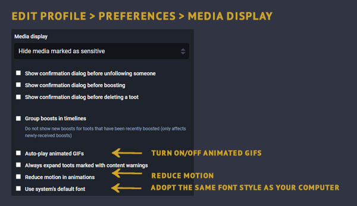

Accessibility Features
=====

Last Updated: November 13, 2022.  

The community is aware that many CounterSocial features are not accessible to some users, and we are committed to making improvements as fast as resources allow. While we work to evolve the platform to accommodate all who wish to participate, below are some features that may help in the meantime. 

Light/Dark Mode
------------
Two site themse are available for both desktop and official mobile app users. To toggle between a light or dark style, click on *Edit Profile* -> *Preferences* and find the *Site Theme* section near the bottom of the page. Remember to click the "Save Changes" button to activate your selection for a light mode or dark mode experience.

PreCog Reading Mode (Beta)
------------
CounterSocial is the FIRST Social Network to build in optional native real-time support for ‘PreCog Reading Mode’. It’s a technique where our technology figures out the first few significant letters in each word and bolds them, making it easier for some readers, especially neurodivergent readers, to glide through text and stay focused.

**Example:** 

To activate PreCog reading mode, navigate to your Preferences section and check the box found under the Real-time PreCog Reading Mode section. Remember to scroll to the bottom of the page afterward to Save  your change. When you return to our homepage, all new posts made by yourself and others will start to appear in PreCog reading mode.

.. attention:: For now, you may need to re-enable PreCog on your desktop each time you first log in for the day. In the app, once activated, PreCog will remain in effect until you log out or manually turn it off.

Adjusting Media
------------

Font Size
^^^^^^^^^^
Would you like to adjust the font size on CounterSocial to make it easier to read? Currently, CoSo does not have a built-in font resizer, but here are some tips to adjust them in other ways:

#. Visit the Media Settings section in your preferences on CoSo and enable “Adopt System Font.” This will force CoSo to use your computer’s font settings. Once enabled, Windows PC users can increase the font size by visiting Window’s Settings > Accessibility > Text Size. This is independent of an overall visual scaling under Settings > Display > Scale. Mac users can access this through System Preferences > Display.
#. You can also zoom in and out of your screen by pressing the CTRL +/- keys or by visiting the View -> Zoom section of your browser’s settings.
#. If you are more technologically inclined, a more DIY approach is the inclusion of a browser extension and adding your own CSS overrides.
#. By resizing your browser width to as narrow as it can go, you can force CoSo to adopt a one-column format, which some prefer. 

 
| 
Mix-and-match any of the options above to improve your experience. If you discover any additional tricks, draft a post and use the #CoSoTips hashtag to let others in the community know! 

Animated GIF Motion Control
^^^^^^^^^^
CounterSocial offers custom settings to help manage the GIFs that appear on your dashboard, a feature especially useful for users with photosensitivity issues. In your preferences section under the heading Media display, you can adjust how GIFs perform, including turning off auto-play or automatically reducing motion. Remember to save your changes when you select these functions.

| 
| 
.. attention:: Have questions or need help? Follow @CoSoTips or tag any post with #help to get support from the community. 
