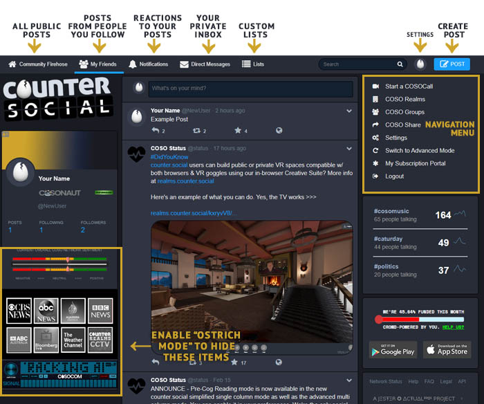
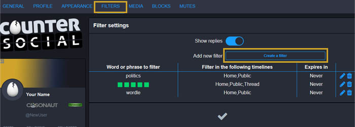
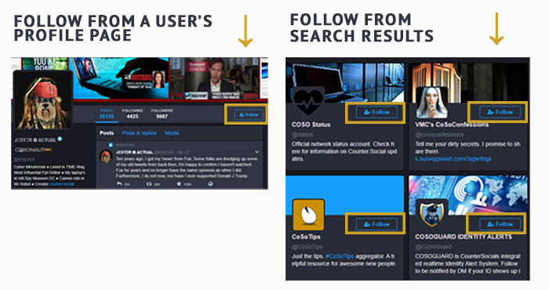

Browsing & Curation - Simplified
=====

Last Updated: November 14, 2022. 

The Simplified Layout
------------

CounterSocial’s (CoSo) Simplified mode organizes your feeds into a one-column layout with a navaigation across the top to toggle between your various feeds. When you first sign up, focus your attention on the “Community Firehose'' column. This column includes everyone’s public posts and is a great place to catch your barings. If you have questions, simply create a post and include the #help hashtag and a member of the community will guide you.

.. tip:: For an even more minimal experience, visit your settings and enable “Ostrich Mode”. This mode will remove the “extras” including the news ticker, CoSoCom emergency radio scanner, and live news station feeds. 

Search
------------

The search bar is located at the top of the page to the left of your avatar image. Look for the magnifying glass icon. Enter your query and hit the Enter/Return key on your keyboard to search. On mobile devices, click the "Return" button and then click "Done" after typing your query to close your keyboard. Results will appear on a new page and are limited to People and Hashtags. Tabs at the top will allow you to toggle between the two. 

Content Filters
------------

If there are topics that you’d prefer not to see, desktop users can filter terms to mute them or drop them completely from your feeds. 

#. Visit your settings via the link in the navigation menu or using the pull-down under your avatar image in the top bar.
#. Navigate to the “Filters” section.
#. Click “Add New Filter”
#. Follow the prompts to add your keyword or phrase, expiration date, and select which feeds you would like the filter to be applied.
#. Click “Add New Filter” to save.

.. tip:: You can also uncheck “whole word” to catch more items with your filters. For example, if you used partial word filtering on “vote,” you wouldn’t see posts about people expressing how devoted (de->VOTE<-ed?) they are to the #catsofcoso hashtag.

Following Users
------------

Click on any username to open their profile in a new window. The “Follow” button is located at the top of their profile adjacent to their avatar. If a user’s account is locked, they will be prompted to approve or deny your request before their posts appear in your Friends feed. If a user has blocked you, the “Follow” button will be inoperable. You also will see a “profile unavailable” message where posts would be.

You can find users to follow by searching for your favorite keywords and clicking the “Follow” icon next to their name in the search results.

Lists
------------
While hashtags allow you to curate custom feeds based on your favorite topics, Lists enable you to curate feeds from your favorite follows. Examples include a list of subject matter experts, your favorite news accounts, or a fun group of close friends. Once a list has been created, you can return to your “Lists” section view the feed for just those accounts.

#. Click the “Lists” link found in the navigation bar at the top of the page.  
#. Click the plus "+" icon to create a new list and give it an appropriate title.
#. Once saved, the list will be added to the sub-navigation just above the page. 
#. The list will not populate until you add at least one account. Use the search bar to find the first addition. Locate any one of their posts and use the pull-down arrow and select "Add [username] to List." Repeat this step to add more.
#. Revisit the Lists section and you will now see your populated list with additional settings to add/remove accounts. 

Mute & Block Users
------------
On CounterSocial, you are encouraged to mute or block people without hesitation if they are annoying you for any reason. Click the three dots at the bottom on any post and select Mute or Block.

When Muting, all Notifications from that user are hidden. If you uncheck “Hide Notifications from this user”, any interactions (Likes, Boosts, Comments) still appear in your Notifications column.

When Blocking, the blocked account disappears entirely from your experience. You will not see messages from them, and they will no longer see you.
To unmute or unblock followers, visit the “Mutes” or “Blocks” links found in your profile settings.

Reporting Abuse
------------
CounterSocial has a zero-tolerance policy towards trolling and community abuse of any kind. This includes spam, hate speech, harassment, gaslighting, sealioning, dis/misinformation campaigns or using the reply or DM features to consistently deliver a negative experience for users. There is no deliberation or appeals process. Reported trolls are “splatted,” often in minutes.

To report content for moderation, click the down arrow icon found on the top right corner of any posts and select the “Report @username” option. **Abusing this feature is also cause for moderation**. If the offending content is simply a case of differing opinions without malice, please use the “Mute” or “Block” options instead.

 |
 |
.. attention:: Have questions or need help? Follow @CoSoTips or tag any post with #help to get support from the community. 