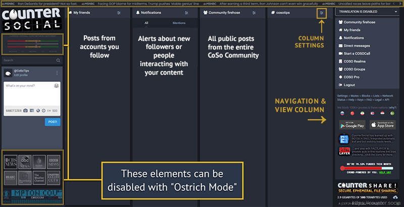
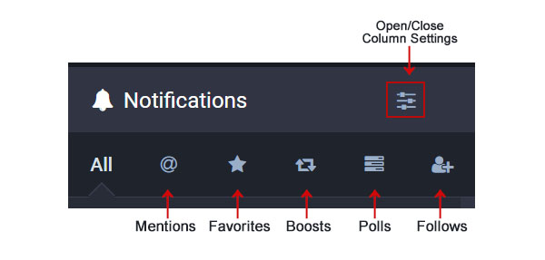
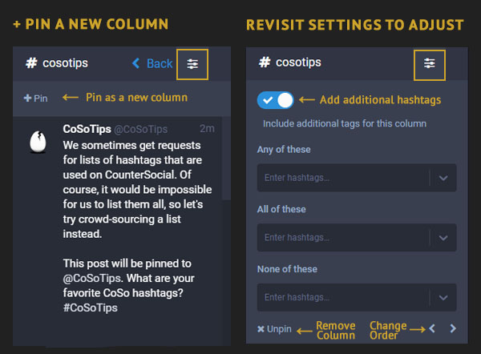
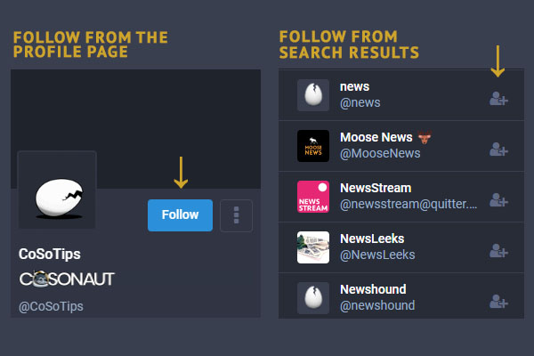
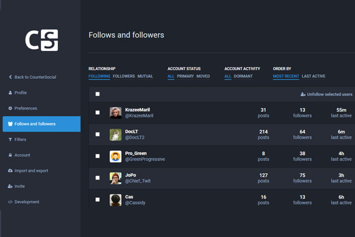
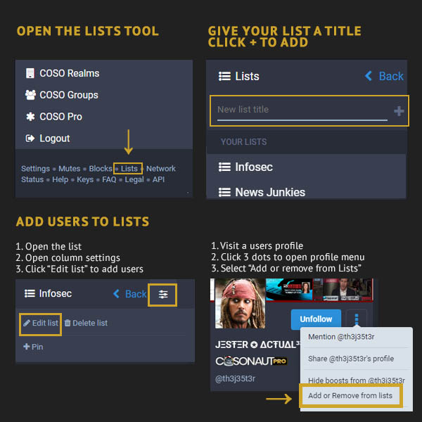

Browsing & Curation
=====

Last Updated: November 14, 2022. 

The Desktop Layout
------------

CounterSocial’s (CoSo) layout presents various content organized in a series of columns. You can have as many or as few columns as you wish and configure each column’s settings to your liking. When you first sign up, focus your attention on the “Community Firehose'' column. This column includes everyone’s public posts and is a great place to start. If you have questions, simply create a post and include the #help hashtag and a member of the community will guide you.

For an expanded, in-depth overview of the desktop layout, visit a CoSo user's  `article published on OnlySky Media <https://onlysky.media/mclark/countersocial-isnt-the-new-twitter-its-something-way-better/>`_.

.. tip:: For a minimal desktop layout, visit Edit Profile > Preferences to enable “Ostrich Mode”. This mode will remove the “extras” including the news ticker, CoSoCom emergency radio scanner, and live news station feeds. If you prefer, you can also resize your browser window. By narrowing the browser window display, you can force a one-column mobile-responsive layout.

Navigation + View Column
------------

When you click on any profile name, hashtag, or post, contents will automatically override the navigation column on the right-hand side of your screen. Doing so will give you an expanded view of various contents, including threads, post replies, hashtag feeds, and full user profiles. When you are done, click the “Back” button at the top to return home to the navigation column. You can reset this column at any time by clicking the G and S keys simultaneously, or by clicking the CounterSocial logo at the far left. 

Search
------------

The search bar is located between the CounterSocial logo and the post box on the left side of the page or in the navigation row at the top of mobile device apps. The top 10 search results are limited to People and Hashtags and will appear  below the search bar. Full post search is not available. Clicking on any result will open in the last “view” column on the right side of the page or as a single column on mobile devices.

Notifications
------------

The Notification column is identified with a bell icon and the word Notifications. To configure your notification settings, click the mixer icon in the top right corner of the column. From here, you can set options for your Quick Filter bar, turn on/off prompts for desktop notifications if your browser offers this function. This feature is disabled on mobile devices by default.

The header also includes some icons for filtering the type of notifications that appear in the column.

**All** - This is the default view and this shows every one of the new messages to your @handle, replies to, favorites and boosts of your posts.

**Mentions** - The ampersand symbol (@) shows posts wherein your @handle was specifically included. This could be replies or new messages calling for your attention.

**Favorites** - The star is for the posts that others (or you) marked as a favorite. It is similar to the “Like” button seen on other platforms, however there is no counting of the number of times a post has been marked as a favorite. This is not a competitive sport.

**Boosts** - The double headed square arrow BOOSTS an existing post. This mimics other platforms’ “Retweet” or “Share” buttons. Like the star, no counting takes place. Please note that, by design, there is no way to “Quote post.”

**New Followers** - Click the person to see a list of all the people who are following you. 

**Poll Reactions** - Polls in which you voted, as well as new polls started by your friends will show up here.

Add or Remove Columns
------------

Are there topics that you want to see all the time? Desktop users can “pin” hashtags in a new column, effectively allowing you to curate a custom feed unique to your interests. The ability to add or remove columns to your mobile app layout is not available.

#. Use the Search box to find any hashtag or click any hashtag within a post to open it in a new column.
#. Click on the settings icon located in the top right of the column
#. Click on the “+Pin” link to add it to your layout.
#. Once pinned, you can revisit the column settings to add additional hashtags or omit keywords from the results.
#. Use the < > buttons to reorder the column in your layout left or right.
#. To remove a column, revisit the column settings and select “Unpin.”

You can repeat these steps to also pin Lists, Groups, or even your DMs.  

.. tip:: Is the firehose too much for you? You can unpin it! If you unpin any of the initial columns such as the Community Firehose, Notifications, or Friends, you can find links in the right-column Navigation to open and repin. 

Content Filters
------------

.. image:: _images/img_filters.jpg

If there are topics that you’d prefer not to see, desktop users can filter terms to mute them or drop them completely from your feeds. 

#. Click on the “Edit Profile” link at the top of your profile page or above the Post box to visit your settings.
#. Navigate to the “Filters” section.
#. Click “Add New Filter”
#. Follow the prompts to add your keyword or phrase, expiration date, and select which columns you would like the filter to be applied.
#. Click “Add New Filter” to save.

.. tip:: You can also uncheck “whole word” to catch more items with your filters. For example, if you used partial word filtering on “vote,” you wouldn’t see posts about people expressing how devoted (de->VOTE<-ed?) they are to #catsofcoso.

Following Users
------------

Click on any username to open their profile in the View column. The “Follow” button is located at the top of their profile adjacent to their avatar. If a user’s account is locked, they will be prompted to approve or deny your request before their posts appear in your Friends feed. If a user has blocked you, the “Follow” button will be light gray and will not respond when you select it. You also will see a “profile unavailable” message where posts would be.

You can also find users to follow by searching for your favorite keywords and clicking the “Follow” icon next to their name in the search results.

Visit your preferences and navigate to the “Follows and Followers” section to view mutual friendships, unfollow dormant accounts, or see your most active friends.

Lists
------------
While hashtags allow you to curate custom feeds based on your favorite topics, Lists enable you to curate feeds from your favorite follows. Examples include a list of industry experts covering a field of interest, your favorite news accounts, or a fun group of close friends. Once a list has been created, you can return to your “Lists” section to open it in a new column and +Pin it to your desktop layout. 

#. Click the “Lists” link found in the right-side Navigation column or mobile app menu.
#. Enter a title for your new list, then click the “+” icon on the right   to “Add List”.
#. Then select the title just created to open the list in the far right column and open the slider icon to the top right.
#. Select “Edit list” and add @names of people you follow.
#. You can also add people you follow to lists by navigating to their profile, clicking the three dots, and selecting “Add or Remove from List” from the pull-down options.

Mute & Block Users
------------
On CounterSocial, you are encouraged to mute or block people without hesitation if they are annoying you for any reason. Click the three dots at the bottom on any post and select Mute or Block.

hen Muting, all Notifications from that user are hidden. If you uncheck “Hide Notifications from this user”, any interactions (Likes, Boosts, Comments) still appear in your Notifications column.

When Blocking, the blocked account disappears entirely from your experience. You will not see messages from them, and they will no longer see you.
To unmute or unblock followers, visit the “Mutes” or “Blocks” links found in the right-column Navigation or mobile app menu.

Reporting Abuse
------------
CounterSocial has a zero-tolerance policy towards trolling and community abuse of any kind. This includes spam, hate speech, harassment, gaslighting, sealioning, dis/misinformation campaigns or using the reply or DM features to consistently deliver a negative experience for users. There is no deliberation or appeals process. Reported trolls are “splatted,” often in minutes.

To report content for moderation, click the three dots in the bottom right corner of the concerning post and select the “Report @username” option. You can also report a user by clicking the three dots found on the top right side of their profile page. **Abusing this feature is also cause for moderation**. If the offending content is simply a case of differing opinions without malice, please use the “Mute” or “Block” options instead.

 |
 |
.. attention:: Have questions or need help? Follow @CoSoTips or tag any post with #help to get support from the community. 