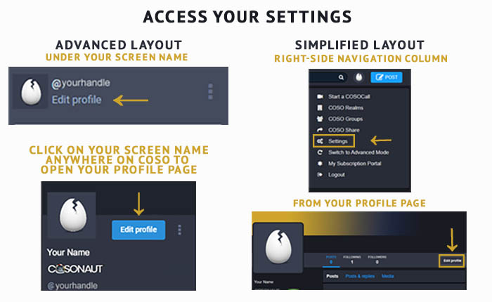
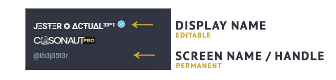
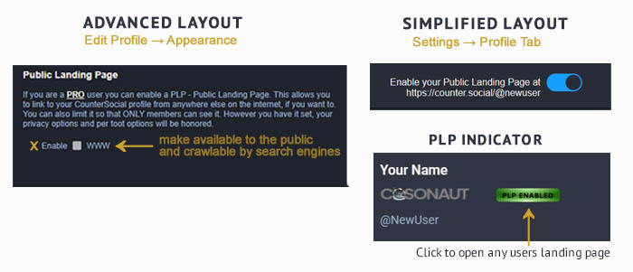

Getting Started
===== 

Last Updated: November 14, 2022.  

Requirements
------------
CounterSocial is accessible using all modern web browsers or via the official CounterSocial (CoSo) mobile apps for iPhone and Android devices. iPad users can access the platform via the device’s web browser. The platform is currently unavailable to users located in Russia, China, Iran, Syria, and North Korea, as well as those arriving via certain VPN, TOR, or proxy addreses.( `Why? <https://counter.social/faq.html>`_ ) 

**Please whitelist Counter.Social with ad blockers, shields, or VPN tunnels through your browser or device.**

Creating Your Account
------------

**To sign up for a free account visit:**

| Desktop/Browser Version: https://counter.social
| Mobile App Downloads: https://smarturl.it/countersocialapp

Your username is fixed and cannot be changed following account activation. This is a security feature to prevent bots and trolls from manipulating the platform. The ONLY way to change your username is to delete your account and create another. Note that once an account is deleted, all traces of the account are permanently removed and cannot be recovered, even by the administrator. The username cannot be reused as a security precaution to prevent others hijacking your name and posing as you.

.. attention:: Following sign-up, you will receive an email from CounterSocial with instructions on activating your account. If you cannot locate that email, you may request a duplicate confirmation email by clicking “Didn’t receive confirmation instructions?” below the login field. 

Setting Up Your Profile
------------
 
You can find all preferences and settings by clicking on the “Edit Profile” link at the top of your profile page. You can access your profile page by clicking on your Display Name.

.. note:: Remember to scroll to the bottom of the page and click the “Save Changes” button after making any changes.

Display Name
^^^^^^^^^^^^^
While your @handle is fixed and unchangeable, you may update your Display Name at any time. The character limit is 24. In the example below, JΞSŦΞR ✪ ΔCŦUΔL³³°¹ is the Display Name and @th3j35t3r is the handle or “screen name.”

Other than badges and a blue check to denote PRO members, CounterSocial does not grant special status or symbols to individual accounts. Users are free to include symbols in their Display Names and the emoji library is available to all users. You can include country flags, check marks (of any color!;-)) or other symbols as your imagination dictates.

 **How to Add an Emoji to Your Display Name**

#. On the main Coso page, navigate to the Post Box.
#. Click on the Insert emoji symbol in the upper right corner of the Post Box to reveal the list of system and custom emojis.
#. Scroll through the emoji and find something snazzy.
#. Tap to enter one (or more) emoji into the text area.
#. Copy the symbol(s) and go immediately to “Edit Profile”.
#. Click “yes” if a pop up asks if you want to Leave site? and continue to the Edit profile area.
#. Paste the symbol(s) in the “Display Name” and/or “Bio” fields.
#. Scroll down and click “Save Changes” before returning to CounterSocial.

Bio
^^^^^^^^^^^^^
Write a short description of yourself to display on top of your profile page. The character limit is 500. Feel free to include hashtags that define your professions, interests, or group memberships so others can find you when those terms are searched.

Avatar
^^^^^^^^^^^^^
Your avatar is the photo or image that appears on top of your profile and next to your post. The default for new users is an egg. Uncrack it now in “Edit Profile” by uploading a PNG, GIF, or JPG image no larger than 2MB in size. Your image will be resized to 85x85 pixels. Square images are preferred.

Header
^^^^^^^^^^^^^
Your header image is the banner that appears on top of your profile page when your screen name or display name is clicked. Please upload a PNG, GIF, or JPG no larger than 2MB. This image will be rescaled to 1500x500px.

 
Configuring Your Preferences
------------
After you have set up your personal profile, use the field below the profile image uploader to set up the following preferences:

Public Landing Page (PLP)
^^^^^^^^^^^^^
Your CoSo profile is private by default. This means that your profile and posts cannot be indexed by search engines, and cannot be crawled by spiders or archiving services.

PRO users can enable their public landing page. Doing so allows your profile and posts to be shared outside of CoSo. To enable PLP, navigate to Edit Profile –> Appearance. Your public share link will be visible below the settings box. Once PLP is enabled, a badge will appear on your profile page, letting other users know you are open to having your content shared with the world.

Lock Account
^^^^^^^^^^^^^
Check the “Lock account” box to make your profile unviewable to all  CoSo users except those you have accepted as friends. If this box is checked, you will need to manually approve all friend requests. Follow requests will appear on your profile page. To approve, click the three dots to the right of your Display Name for a flyout menu and choose Follow Requests to see who is asking. You can click through to their profiles before choosing to accept or reject the request. No harm no foul, follower counts are not worth a hill of beans here.

Directory Listing (Coming Soon)
^^^^^^^^^^^^^
While the Directory is currently in development, select this box to be included in a searchable index of Counter.Social users when it launches. If you have included hashtags in your bio, your profile will be listed in each respective hashtag group.

Profile Metadata
^^^^^^^^^^^^^
CoSo allows you to display up to 4 items in a table at the top of your bio. You can use these fields to display your location, pronouns, website/social links, or labels.

If including links to websites that you control, a verification method is provided which will result in a green check next the links at the top of your profile. Currently, this feature is only available for sites that allow you to embed HTML code. 

| 
| 
.. attention:: Need help? Write a post and include the #help hashtag for support from the community. 
