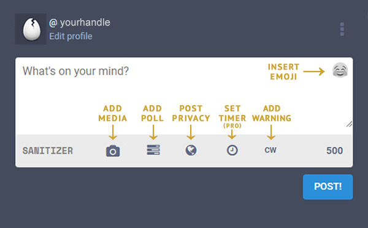
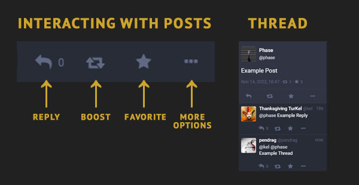
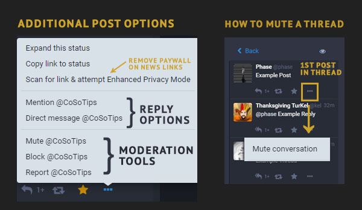
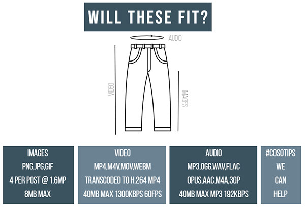
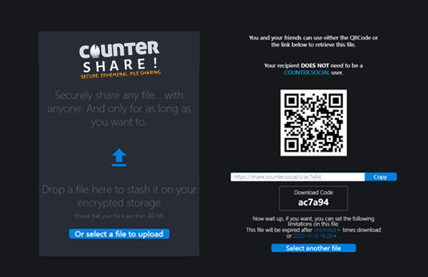
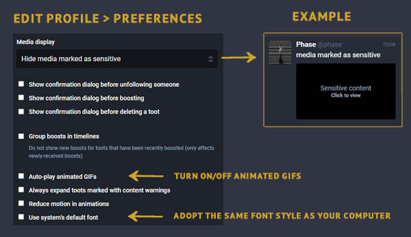
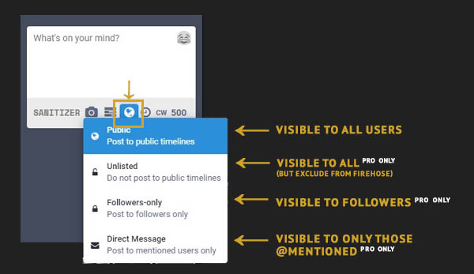
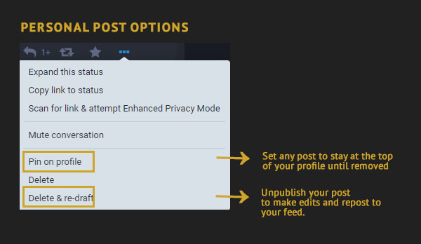

Posting Content - Advanced
=====

Last Updated: November 14, 2022. 

The Post Box
------------

The Post Box is in the left column on the desktop version or by pressing the blue pencil icon on the bottom right corner of your mobile device. The default character limit for text posts is 500 characters and you can include links, hashtags, polls, content warnings, and emojis. PRO users can adjust privacy preferences at the post level, as well as set an expiration date for a post to expire and self-destruct.

Responding to a Post
------------

To **REPLY** to a post, click the left arrow at the bottom of the original post. Doing so will automatically open the post box to the left where you can type your reply. The @handle of the author of the post you are responding to will be pre-populated in the post box. If you are a PRO user, you can lock your response to the original post, and all subsequent replies in the thread after yours will also be locked. A locked post cannot be unlocked by another user’s reply. (see PRIVACY SETTINGS below)

The **BOOST** is the double-headed square arrow, and it mimics the other platforms’ “Retweet” or “Share” buttons for existing posts. Boosts are only shown to your followers, and do not post to the Firehose.

The **FAVORITE** star is your way to acknowledge that you read the post. It means different things to different users, and the total number of favorites is not prioritized here. A record of your previous favorites is not viewable to either yourself or others through a separate list.
The three dots at the bottom right of the post open to a flyout menu with additional response options. Of note, “Expand Status” will open the post in context of the thread in which it appears, if it is a reply to another post. This expanded status will open to the right in a new column. “Report” is another option on this menu and is your means of flagging a post that violates the TOS. 

To **THREAD** a series of posts to communicate a longer message, simply REPLY to your preceding post.

Additional options can be found by clicking the three dots at the bottom of any post, including a option to mute any threads you are included in but no longer want to be notified of new responses. You can also access moderation tools including the Mute, Block, and Report funtions.  

 
Links & Link Sanitizer
------------
CounterSocial (CoSo) doesn’t track its users, but even better than that - we don’t let 3rd parties track you either. All outbound links are automagically sanitized to remove any embedded tracking parameters. Be sure to include any links at the *end* of your post, to prevent any other post text from being inadvertently trimmed by this feature. In the case where this impacts your link’s functionality, type /nosanitize anywhere in your post to turn off this feature. The most common case for this is time-stamped YouTube videos.

Once posted, the platform will automatically preview the content linked including news headlines, article card images, and/or functional media players such as YouTube, Bandcamp, Soundcloud, and Spotify, if such a preview is available. These link previews are generated the first time your link is clicked or the next time you refresh your feed.

Hashtags
------------
To make your posts more searchable and discoverable by other users, add a hashtag by prepending a keyword with the pound (#) symbol. As you type, you will see suggested hashtags already in use below the post box. CounterSocial is hashtag-driven with many users configuring their feeds to display only desired hashtags and keywords, or by using filters to omit this content from their views.

`Click Here <https://cosoguide.readthedocs.io/en/latest/popular-hashtags.html>`_ for a list of the most commonly used hashtags.

Attaching Media & Files
------------
Click on the camera icon to attach photos, animated GIFs, or videos to your post. On the desktop version, you can also drag-and-drop the media file to the post box to auto-upload. PRO accounts can share other file types with  CoSo’s internal CounterShare file sharing service.

 
Sharing Image & Video Files
^^^^^^^^^^^^^

+---------+-------------------------------------------+---------------+
| Type    | Files Accepted                            | Max Size      |
+=========+===========================================+===============+
| Images  | PNG, JPG, GIF                             | 8mb           |
+---------+-------------------------------------------+---------------+
| Video   | MP4, M4V, MOV, WEBM                       | <1min; 40mb   |
+---------+-------------------------------------------+---------------+
| Audio   | MP3, OGG, WAV, FLAC, OPUS, AAC, M4A, 3GP  | 40MB Max      |
+---------+-------------------------------------------+---------------+

.. note:: To protect your privacy, CounterSocial automatically scrubs all meta-data from your media files including photo orientation. If you upload an image and it is not oriented correctly, use the delete & redraft option to edit your post. Make a minor edit to the original image file, save it, and re-upload to correct the issue.

Sharing Non-Supported File Types
^^^^^^^^^^^^^

PRO users can utilize *CounterShare*, CoSo’s integrated, secure, ephemeral 500TB file sharing solution. It’s at-rest encrypted, and your files can be time-limited or restricted to a specific download count. Files can be shared with ANYONE (whether a PRO user or not). You can access file sharing by visiting https://share.counter.social, or by clicking on the CounterShare graphic at the bottom of your right-side Navigation column.   

Editing Media
^^^^^^^^^^^^^
Once attached, hover over the image thumbnail and click the “Change Preview” link to adjust the image preview. Please add a text description for the visually impaired by clicking on the photo where it says “Describe for the visually impaired”. The description will appear for users accessing CoSo via a screen reader or other similar technology.

If your image, GIF, or video is not safe for work , contains mature, adult or graphic content, or may negatively impact those with post traumatic stress disorder or photosensitivity issues, please click on the eye icon to mark your media as sensitive. To add a content warning to your post, click on the “CW” icon (doing so will also mask any photographs) 

.. warning:: CounterSocial is committed to providing NO SAFE HAVEN for Child Sex Abuse Material. All uploaded images are hashed and compared against NCMEC databases of known CSAM hashes at our infrastructure edge. 

Setting Your Media Preferences
^^^^^^^^^^^^^
Navigate to Edit Profile –> Preferences and scroll to the Media Display section to configure defaults for how you want media to display in your personal feeds. You can automatically hide all media marked as “sensitive,” choose if animated GIFs auto-play or even reduce their motion.

Post Privacy Settings
------------
Once you have configured your post, PRO users can set the privacy at the post draft level, including unlisted, private, and direct message posting. PRO users can also visit Edit Profile –> Preferences to set the default privacy level for all future posts.

**Public** - Posts appear in the community firehose, your friend’s timelines, and on your profile page. If your `Public Landing Page <https://coso-userguide.readthedocs.io/en/latest/getting-started.html#public-landing-page-plp>`_  is enabled, these posts are visible to the general public and are indexed by search engines. This is the default setting for regular users. 

**Unlisted (PRO Feature)** - Same as Public posts, but posts do not appear in the community firehose. This setting is most commonly used to make public posts visible on your Public Landing Page without entering them on the primary community feed. 

**Followers-Only (PRO Feature)** - Visible only to users that follow you and anyone mentioned in the post. These posts cannot be boosted, except by yourself.

**Direct Message (PRO Feature)** - Visible to only the user(s) mentioned (@) in the post. The recipient will receive a notification. All DMs are encrypted and cannot be accessed by any other party, including The Jester, unless they are mentioned. Initiating a DM is a PRO feature, which helps eliminate DM spam, scams, and phishing attempts. Recipients of DMs do not need to be a PRO account. If you are a regular user and wish to have a private conversation with a PRO user, simply ask them to initiate the DM from their side.

Editing Existing Posts
------------
Rejoice! A version of the “edit” button has arrived. After posting, if you need to make changes to your post, click the three dots in the bottom right corner and select “Delete & Redraft” to make changes and repost. Keep in mind, all boosts and favorites will be reset (deleted), and any original replies will not be linked to the new version. For instructions on editing a photo to change its orientation, see the `Editing Media <https://coso-userguide.readthedocs.io/en/latest/posting-content.html#editing-media>`_ section, above.

You can also delete the post completely, or select “Pin on Profile” to make it stay at the top of your profile page. You may have up to 5 pinned posts on your profile.

.. attention:: Have questions or need help? Follow @CoSoTips or tag any post with #help to get support from the community. 
