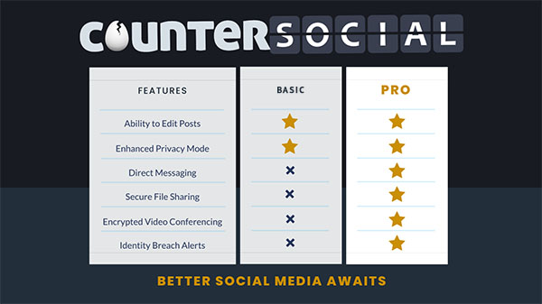
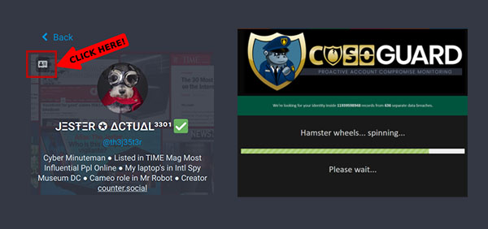
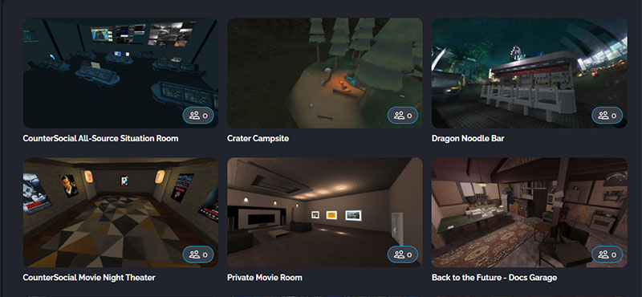
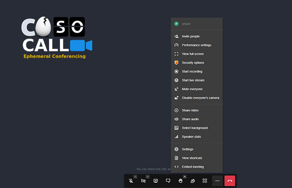

PRO Features
=====

Last Updated: November 14, 2022. 

PRO vs Basic Subscriptions
------------
CounterSocial is 100% community-funded, primarily through a PRO subscription that unlocks additional tools and features. A PRO subscription is not required to participate and enjoy the core CoSo experience. However, at about the price of a fancy cup of coffee per month, the increased privacy, security, zero spam, and ad-free experience is well worth the price to keep the servers running every month. For now, PRO subscriptions are charged monthly and cannot be paid in advance or gifted to other users.

How to Upgrade to PRO
------------

CoSoPro subscriptions are processed through an established and secure 3rd-party payments processor and are managed through the `PRO Subscription Portal <https://counter.social/accmgt/getpro.php>`_. Once signed-up, CounterSocial verifies your status using the email address you have provided.

#. Visit the `PRO Subscription Portal <https://counter.social/accmgt/getpro.php>`_ or navigate to the CoSoPro link in the right-column navigation menu.
#. Click the neon green “Upgrade Me” button.
#. It is important that you use the SAME email you used to sign up for CoSo to sign up for the PRO Portal so CoSo can verify your status. There is no retrieval system to locate the email address you used to sign up. A page will open asking you to acknowledge this requirement.
#. Click on “Continue to Payment” to be redirected to our 3rd party payment gateway.
#. Follow the prompts and continue to activate your subscription. U.S. citizens or legal residents of the U.S. can add an extra layer of privacy, not just for your CoSo subscription for any online transactions with Privacy.com, a virtual card that can mask your name, address, and credit card information.
#. Keep your username and password in a safe place.

 
 **Thank you for going PRO**

 .. attention:: After your subscription is complete, return to Counter.Social and log out. Once you log back in, the platform will check your status and activate your PRO features. In some cases, this can take a few minutes and require you to reset your browser’s cookies or refresh your cache.

How to Get Help with Your PRO Account
------------
You can return to the `PRO Subscription Portal <https://counter.social/accmgt/getpro.php>`_ to manage your account, update billing info, or cancel your subscription at any time. If you have problems accessing the portal, please use the password reset reminder located below the login field. For help with any other issues related to your PRO subscription, please email **payments(@)counter.social**.

CoSoGuard
------------

CounterSocial has integrated automatic and one-click on-demand identity theft alerts. COSOGuard is checking the open and dark web all day and night. If your identity is caught up in a breach - you’ll know! PRO users can access their breach reports any time by clicking on the ID icon in the top left corner of their personal profile. Follow @CoSoGuard to be notified via DM anytime a new breach is identified.

CounterShare
------------
.. image:: _images/img_countershare.jpg

PRO users can utilize *CounterShare*, CoSo’s integrated, secure, ephemeral 500TB file sharing solution. It’s at-rest encrypted, and your files can be time-limited or restricted to a specific download count. Files can be shared with ANYONE (whether a PRO user or not). You can access file sharing by visiting https://share.counter.social, or by clicking on the CounterShare graphic at the bottom of your right-side Navigation column. 

CoSo Groups
------------
COSO Groups (Beta) is a PRO feature that allows our users to create their own communities. Groups or channels can be public or private. OTR Encryption can be enabled for private messages or conversations. PRO users can access Groups via the CoSoGroups link in the right-side Navigation column. You can also pin your group directory as a new column in your desktop layout. 

CoSoRealms
------------

COSO Realms is a virtual collaboration platform available to CounterSocial PRO members that runs in your browser. With Realms you can create your own 3D virtual reality spaces with a single click and invite others to join using a URL. No installation, VR headset, or special app required. PRO users can access Realms at https://realms.counter.social or through the link found in the right-side Navigation column.

`Click here <https://countersocial.documize.com/s/c2irfhkp0nhtab602ne0/coso-realms>`_ to access the CoSoRealm's User Guide. 

.. attention:: Safari web browser and all iOS devices (iPhone and iPad) are not supported. To access Realms, we recommend using Chrome, Brave, or Edge browsers at this time. Please allow 1-2 minutes for the platform to authenticate your PRO subscription when you log in for the first time.

Movie Nights
^^^^^^^^^^^^
All PRO users are invited to join us for for Movie Night inside the CoSoRealm’s Movie Theatre. Showings are typically every Friday at 6pm PST / 9pm EST, but the days and times may change.

Follow the @MovieNights account for the upcoming schedule of films including special screenings and events catering to members located in different time zones. You can visit the Movie Night Theatre at https://movienights.counter.social.

CoSoCall
------------

COSOCall is a secure, ephemeral video-conference service that can be initiated with ONE-CLICK by CounterSocial PRO users. Each conference is 100% encrypted, password protectable, and freely shareable to ANYONE on the internet whether they are a member of CoSo or not.

PRO users can launch a video or audio conference call at any time by clicking on the “Start a COSOCall” link found in the right-column Navigation menu. Once initiated, click on the three dots […] in the bottom menu to configure settings, invite others, and/or embed the meeting.

Exploding Posts
------------
Have something you want to share with the community, but don't want to keep it online for the rest of your CoSoLife? PRO users can now set your post to  'self-detonate' by clicking on the timer icon at the bottom of the post box. It doesn't matter if you are insuring yourself against stalkers and harassers or you just like to keep a tight ship when it comes to your online footprint.

| 
| 
.. attention:: Have questions or need help? Follow @CoSoTips or tag any post with #help to get support from the community. 
