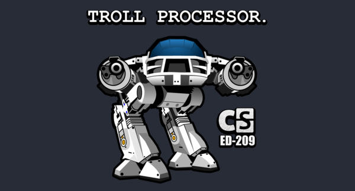
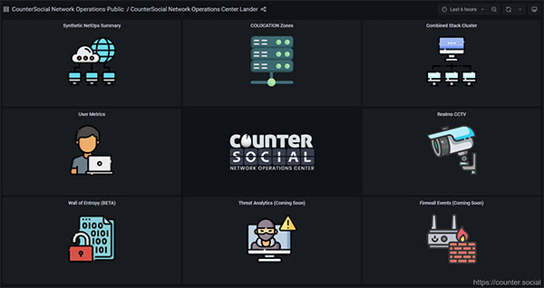

Transparency
=====

Last Updated: November 14, 2022. 

Who is The Jester?
------------

The Jester (aka th3j35t3r or JΞSŦΞR ✪ ΔCŦUΔL) is a prolific hacktivist and cyber minuteman on a mission to fix social media. After watching our communication systems become corrupted by disinformation, division, foreign influence, and propaganda campaigns, he shifted his focus from the destruction of threats to the creation of a platform designed to counter them. In 2017, he launched CounterSocial. The Jester is listed as one of TIME Magazine’s Most Influential People Online, and his laptop is exhibited in the International Spy Museum in Washington, DC. His alleged escapades are documented in articles and programs by NBC, Homeland Security Today, Gizmodo, Newsweek, Tech Insider, the Larry King Show, and others. Some may have noticed his cameo role in the USA Network TV show *Mr. Robot*.

`Click here <https://counter.social/whojay.html>`_ to learn more.

Abuse Policy
------------

CounterSocial (CoSo) takes a zero-tolerance stance to hostile nations, bot accounts, `trolls <https://en.wikipedia.org/wiki/Troll_(slang)>`_, provocateurs, and abuse. This includes users participating in `cyberbullying <https://en.wikipedia.org/wiki/Cyberbullying>`_, `astroturfing <https://en.wikipedia.org/wiki/Astroturfing>`_, gaslighting, baiting, `sealioning <https://en.wikipedia.org/wiki/Sealioning>`_, and dis/misinformation campaigns. Hate speech and harassment is also prohibited. While CoSo will block obvious offenders, tools are provided to mute/block any user or filter any keyword that you find offensive or unwanted in your personal view. 

Privacy, Security & Encryption
------------
CoSo is a security-focused platform with advanced features to protect your privacy. There are no friend-finding tools that scan your contacts, push notifications that track your location, or spammers crawling your feeds to datamine demographic data. CoSo does not ask for or store any personal data on its servers besides the email address used to create your account. All payments are handled by a professional 3rd party payments processor and payment card details are not seen by CounterSocial or stored on CounterSocial infrastructure. By default, privacy settings for new accounts cannot be indexed by search engines, spiders, crawlers and archivers or made available outside of the CounterSocial domain unless changed in your account’s preferences and settings. Direct messages (DMs) are at-rest encrypted and in addition can be set to auto scrub (both sides of a conversation, from all devices involved).

The Team
------------

CounterSocial is operated and managed solely by The Jester. There are no executives, board of directors, or employees. The CoSo community self-moderates through a unique structure that surfaces troll, bot, and abuse sightings, escalates support issues, and empowers every user to contribute to the health and safety of the overall platform.

Funding
----------------

CounterSocial is funded by The Jester and supplemented by the community through a PRO subscription, a premium that unlocks additional features and functionality. The platform also accepts private donations through Donorbox, Patreon, and direct Bitcoin transfers. These funds pay for the server, bandwidth, and software needed to keep CoSo running. Funding progress toward the monthly goal is displayed through the meter in the platform’s navigation column. There are no investors, stakeholders, or venture capital initiatives funding this project. This means there are no ads, and your data is not for sale.
 

CoSo is 100% community funded. `Click here <https://counter.social/supportcoso.html>`_ to offer your support.

System Metrics
----------------

CounterSocial developed several custom dashboards to provide transparency and offer an at-a-glance view of system performance, user trends, and new member evolution. CoSo constantly monitors the internet ecosystem to mitigate threats to our community. The Jester has developed real-time tools to show us the threats CoSo encounters  as they occur CoSo Realtime Threat Dashboard shows who is trying to hack and/or infiltrate CoSo, by country of origin, hostname, and username. You can read more about the strategy at https://counter.social/faqs.html

`Click here <https://netops.counter.social>`_ to launch the Netops Dashboard. You can also access it at any time by clicking on the “Network Status” link in the desktop version’s right-side Navigation column. The four-square tile icon on the left will open a flyout menu with the Home dashboard icon. Select that to access the Networks Operation Center.

Relationship to Mastodon
----------------

CounterSocial is a hard fork of the Mastodon network under the Free Software Foundation (FSF) Affero General Public License (AGPL). At this time, we are an independent instance separated from the Mastodon federation. CoSo has its own Terms of Service and additional features installed on separate servers to supplement Mastodon software with proprietary security and resources for the health and safety of the community.

Read `The Short History of CounterSocial and Mastodon <https://countersocial.documize.com/s/c30dhakp0nhtab60utag/countersocial-blog/d/c5piofvuaqg133k3is90/the-short-history-of-countersocial-and-mastodon/>`_ for more info. 

Licenses & Policies
----------------

| Licensing:  https://counter.social/license.html
| Terms of Service: https://counter.social/terms.html
| Privacy Policy: https://counter.social/privacy.html
| DMCA Policy: https://counter.social/dmca.html
| GDPR Policy: https://counter.social/gdpr.html
| CCPA Policy: https://counter.social/ccpa.html

| 
| 
.. attention:: Have questions or need help? Follow @CoSoTips or tag any post with #help to get support from the community. 
